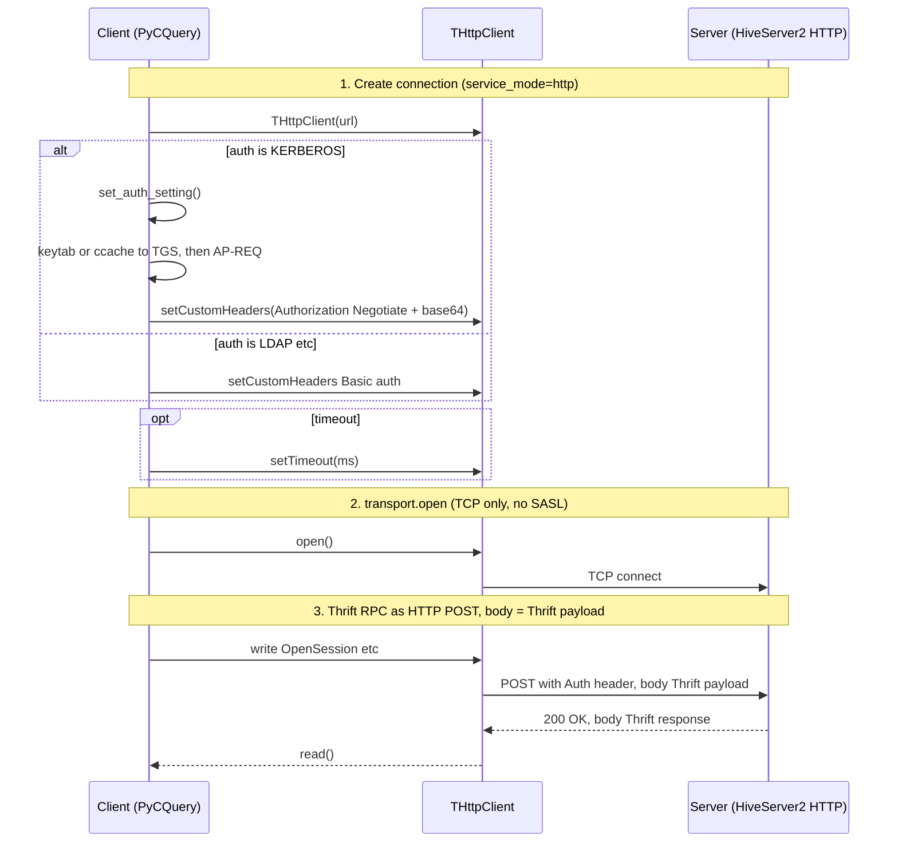
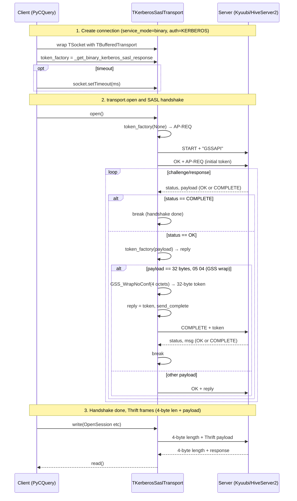
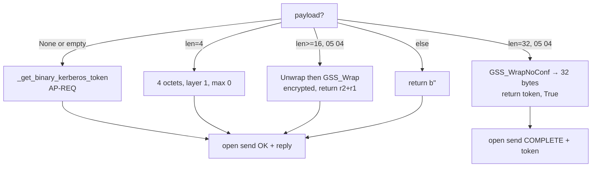

# Thrift transport flows

---

## Thrift HTTP

In HTTP mode, the client uses `THttpClient` to send requests to `http://host:port/http_path`. There is no SASL handshake; authentication is carried in **HTTP headers** (e.g. Kerberos: `Authorization: Negotiate <token>`, LDAP: Basic).

---

## Thrift Binary + Kerberos SASL

In Binary mode with Kerberos, a **SASL GSSAPI handshake** runs over TCP first; afterward, traffic is sent as 4-byte length + Thrift payload frames.

### Sequence diagram

## Token factory branches (_get_binary_kerberos_sasl_response)

